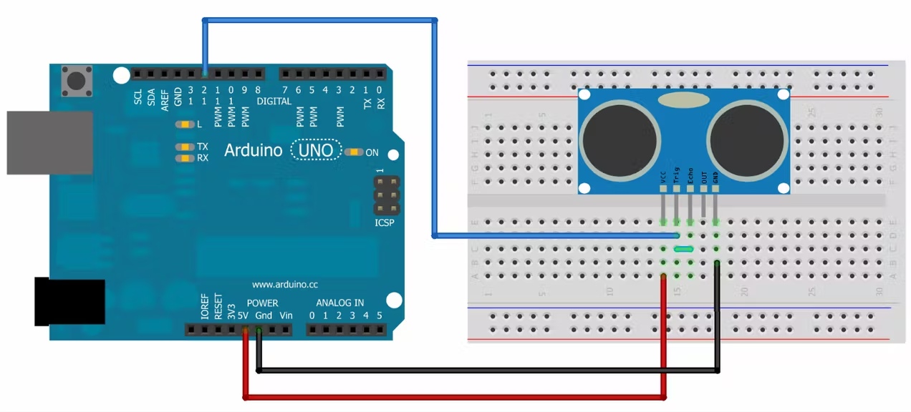

# Distance Sensor Ultrasonic
### _Basic Project For Calculate and Displaying Distance_

### Components 
- [x] Arduino Due
- [x] Module HY-SRF05 Ultrasonic
- [x] Jumper Wire Male to Female

### Schemantics

